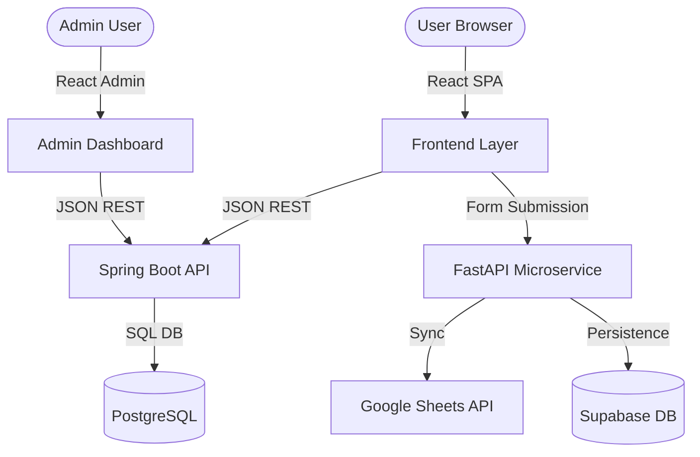

# NexaSphere System Architecture

Welcome to the NexaSphere System Architecture overview. This document details the system design, structural layout, components, and data workflows of the NexaSphere Community Platform.

---

## 🗺️ System Topology

NexaSphere uses a decoupled multi-service architecture comprising:
1. **Frontend App**: SPA built with React 18 & Vite, running dynamic client-side pages and gamification interfaces.
2. **Admin Dashboard**: Isolated admin control application managing events and platform moderators.
3. **API Java Backend**: REST API microservice built on Spring Boot 3 handling authentication, core data models, and database communication.
4. **Python Microservice**: FastAPI server managing form entries and syncing data with Supabase/Google Sheets.

---

## 📁 Repository Directory Structure

- **`src/`**: Main community portal codebase.
  - **`components/`**: Reusable elements (calendar, moderation widgets, recommendation feeds).
  - **`pages/`**: Primary page screens (Home, Events, Membership, Recruitment).
  - **`shared/`**: Reusable generic widgets (Footer, Custom Icons, Navigation).
  - **`services/`**: API abstraction client utilities.
- **`admin-dashboard/`**: Moderator dashboard portal interface.
- **`server-java/`**: Core API server logic.
- **`server-python/`**: Google Sheets forms sync router.

---

## 🔄 User Recommendations & Gamification

- **Interactions Tracking**: Local user interest engine tracking categories and tags from event clicks.
- **Recommendation Engine**: Generates match scores using Cosine/Jaccard similarity models over interests.
- **XP & Levels Progression**: Automatically adjusts points on completing community activity milestones.
